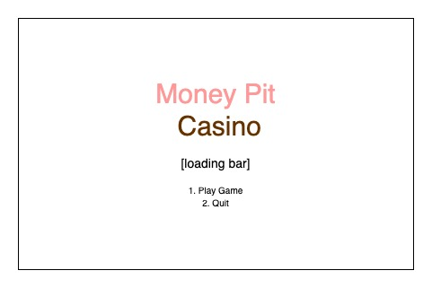
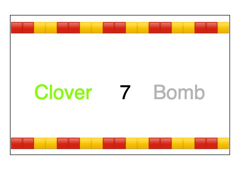
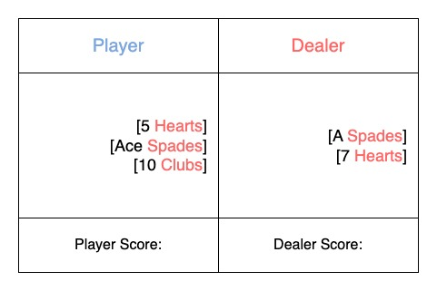
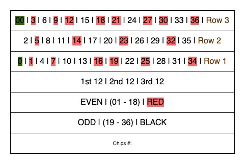
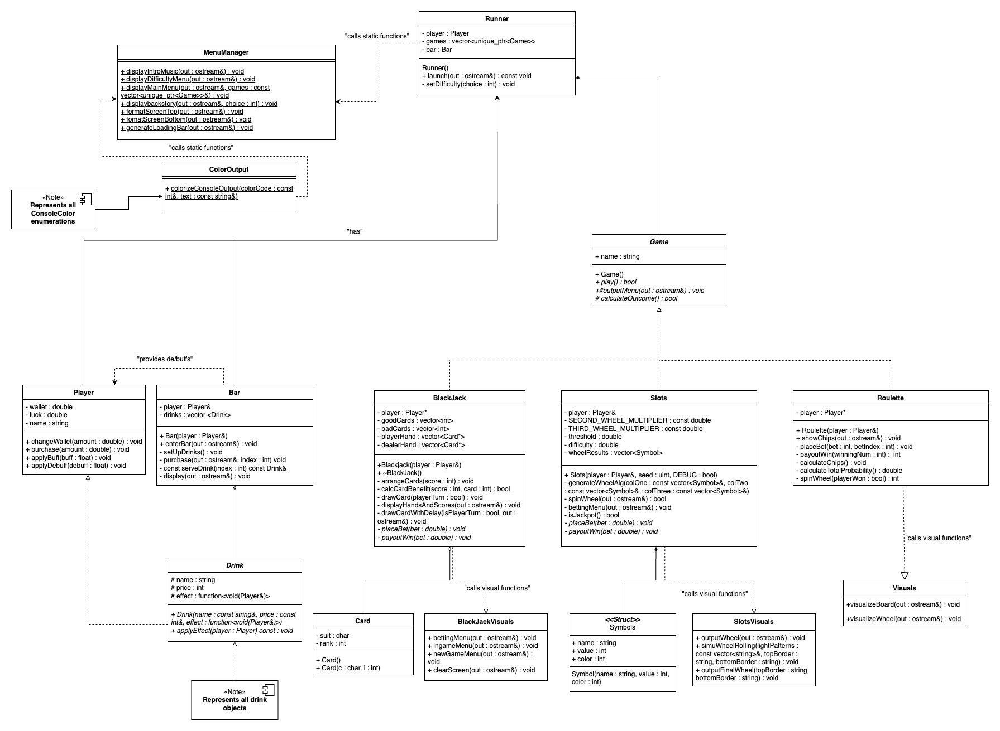
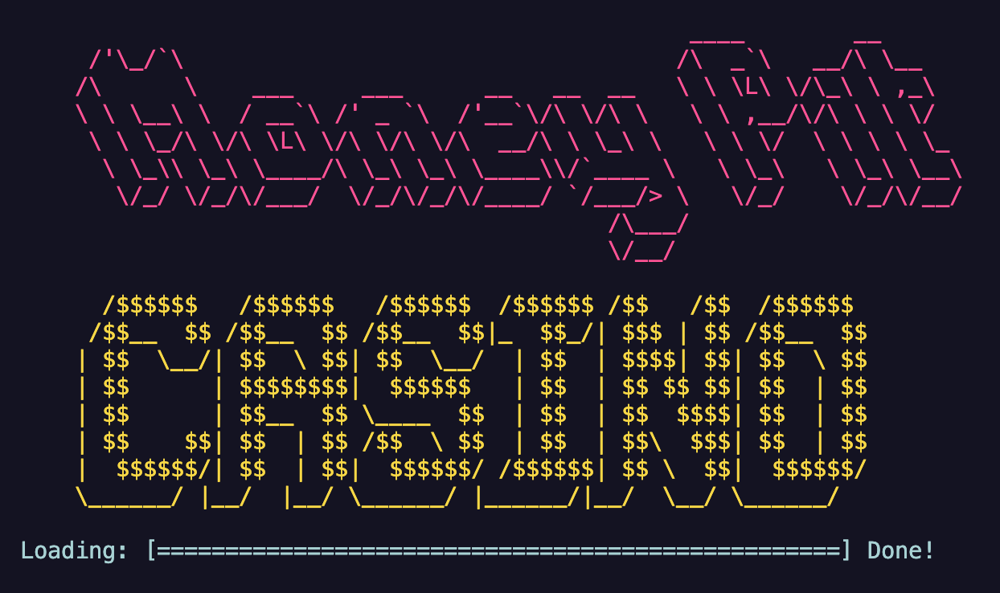
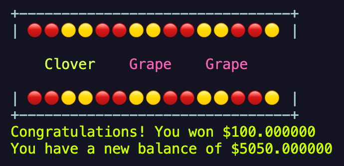
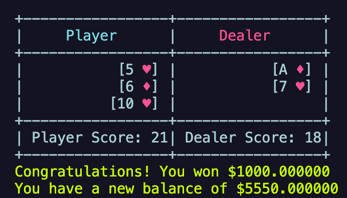
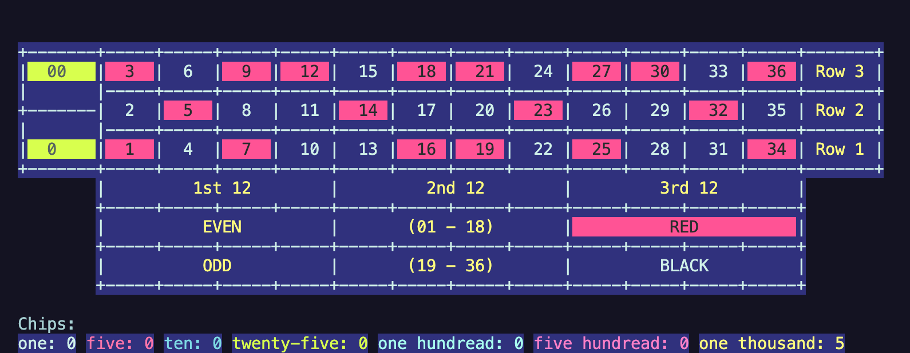

<!---
 > As you complete each section you **must** remove the prompt text. Every *turnin* of this project includes points for formatting of this README so keep it clean and keep it up to date. 
 > Prompt text is any lines beginning with "\>"
 > Replace anything between \<...\> with your project specifics and remove angle brackets. For example, you need to name your project and replace the header right below this line with that title (no angle brackets). 
# McMoney Pit > Your author list below should include links to all members GitHub (remove existing author). --->
# Money Pit Casino
 
Authors: [Dmitry Sorokin](https://github.com/Dekamayaro), [Owen Puente](https://github.com/ChickensRock4), [Henry Yost](https://github.com/henry-AY), [Tarun Upadhyay](https://github.com/Tarun-Upadhyay05)

<!--- > You will be forming a group of **FOUR** students and working on an interesting project. The project has 4 phases, each one with specific requirements. A list of proposed project ideas that have been successful in previous quarters is listed in the project specifications document on Canvas. You can select an idea from the list and start thinking about the features you will implement. If you want to propose your own original idea, you will have to contact your instructor to discuss the project and obtain written permission before you submit your project proposal (Phase 1). The project work should be divided almost equally among team members. You can of course help each other, but it needs to be clear who will be responsible for which features. Additionally, you are expected to follow Scrum patterns, specifically the use of a Scrum (Project) board, Sprints, and Scrum meetings. --->

<!---
 > ## Expectations
 > * The backend of your project should be implemented in C++. If you wish to choose anoher programming language (e.g. Java, Python), please discuss with your lab TA to obtain permission.
 > * You can incorporate additional technologies/tools but they must be approved (in writing) by the instructor or the TA.
 > * Each member of the group **must** be committing code regularly and make sure their code is correctly attributed to them. We will be checking attributions to determine if there was equal contribution to the project.
 > * **Each member of the group must actively participate in the Github Project board, writing unit tests, and reviewing commited code.**
> * All project phases are to be submitted to this GitHub repository. You should modify this README file to reflect the different phases of the project. In addition, you should regularly hold sprint meetings with your group. You will need to hold two to three scrum/check-in meetings with your lab TA/reader at different times in addition to the final demo. --->

## Project Description
Money Pit is a casino simulation game, with a twist of buffs and debuffs that the character can acquire throughout their gameplay. This idea interests our team because you take a conventionally rigged and unbalanced game, and turn it into a game 
where the balance can shift to either side with the strategic element of luck modifiers. 

# Key Features
- Classic Casino Games: Slots, Roulette, and Blackjack, represented in ASCII Graphics.
- Luck Modifiers: Randomly applied buffs and debuffs affect the player's odds, shifting game balance and making each playthrough unpredictable.
- Visual Feedback: Displays balance, win/loss streaks, and performance stats, through console output.

# Technical
- Language & Graphics: Programmed in C++ with ASCII console graphics
- User Interaction: Console character input for actions such as placing bets, spinning slots, ordering drinks, etc...
- Development Tools: Version control with Git, IDEs of each developer's choice.

<!--- You also need to set up an empty project board using GitHub projects (board view with default columns). Make sure you add the board under your project repository. You should also have a Product Backlog and In testing columns added. All columns should be in the right order.

 > ## Phase II
 > In addition to completing the "User Interface Specification" and "Class Diagram" sections below, you will need to:
 > * Create an "Epic" (note) for each feature. Place these epics in the `Product Backlog` column
 > * Complete your first *sprint planning* meeting to plan out the next 7 days of work.
 >   * Break down the "Epics" into smaller actionable user stories (i.e. smaller development tasks). Convert them into issues and assign them to team members. Place these in the `TODO` column (aka Sprint Backlog).
 >   * These cards should represent roughly 7 days worth of development time for your team. Then, once the sprint is over you should be repeating these steps to plan a new sprint, taking you until your second scrum meeting with the reader in phase III.
 > * Each team member needs to submit the Individual Contributions Form on Canvas for this phase. In this form, you need to fill in the names of all team members, the percentage of work contributed by each member for phase  II, and a description of their contributions. Remember that each team member should submit the form individually.
 > * Schedule two check-ins using Calendly. Both time slots should be during your lab on week 6. Your entire team must be present for both check-ins.
 >   * The first check-in needs to be scheduled with your lab TA. During that meeting, you will discuss your project design/class diagram from phase II.
 >   * The second check-in should be scheduled with a reader. During that meeting you will discuss:
 >     * The tasks you are planning for the first sprint
 >     * How work will be divided between the team members

--->

## User Interface Specification
<!---
 > Include a navigation diagram for your screens and the layout of each of those screens as desribed below. For all the layouts/diagrams, you can use any tool such as PowerPoint or a drawing program. (Specification requirement is adapted from the User Interface Design Document Template of CMSC 345 at the University of Maryland Global Campus)
--->

### Navigation Diagram
<!---
> Draw a diagram illustrating how the user can navigate from one screen to another. Here is an [example](https://creately.com/diagram/example/ikfqudv82/user-navigation-diagram-classic?r=v). It can be useful to label each symbol that represents a screen so that you can reference the screens in the next section or the rest of the document if necessary. Give a brief description of what the diagram represents.
--->
When the user first starts the game, they are greeted with a welcome screen describing the controls and goal of the game. After, they go to a "lobby" where the player can choose to go to the bar or play one of the three games. In any of the games or the bar the player can choose to return to the lobby, where they can choose a different game, or go to the bar, or quit the game.

<p align="center">
 
</p>

### Screen Layouts
<!---
> Include the layout of each of your screens. The layout should describe the screen’s major components such as menus and prompts for user inputs and expected output, or any graphical user interface components if applicable (e.g. buttons, text boxes, etc). Explain what is on the layout, and the purpose of each menu item, button, etc. If many screens share the same layout, start by describing the general layout and then list the screens that will be using that layout and the differences between each of them.
--->

#### Title Screen

<p align="center">
 
</p>


**Purpose**: Provides an engaging introduction to the game while the application loads.

- **Title**: Displays "Money Pit Casino" in colorful ASCII art.
- **Loading Indicator**: A progress bar at the bottom shows the loading process and finishes with "Done!"
- **Styling**:  
  - Vibrant red and yellow ASCII text art enhances visual appeal.  
  - Modern terminal aesthetics set the tone for the casino theme.

---

#### Slots Gameplay

<p align="center">
 
</p>


**Purpose**: Allows the player to play a game of slots, place bets, and view results.

- **Game Area**:  
  - Grid of slot outcomes, showcasing symbols such as "Diamond" and "7."  
  - Displays winning/losing combinations in an organized, grid-like format.  
- **Player Feedback**:  
  - Messages in green to indicate a win (e.g., "Congratulations! You won $1000.00").  
  - Updates player balance (e.g., "You have a new balance of $5900.00").  

---

#### Blackjack Gameplay

<p align="center">
 
</p>


**Purpose**: Allows the player to play a game of Blackjack, place bets, draw cards, and view results.

- **Game Area**:  
  - **Table Layout**: Displays the player's and dealer's hands in a table format with borders and separators.
  - **Player's Hand**: Shows the cards in the player's hand along with the player's score.
  - **Dealer's Hand**: Shows the cards in the dealer's hand along with the dealer's score.
  - **Player Score**: Displays the player's current score.
  - **Dealer Score**: Displays the dealer's current score.

- **Player Feedback**:  
  - **Messages**: 
    - In green to indicate a win (e.g., "Congratulations! You won $1000.00").
    - In red to indicate a loss (e.g., "You lost $500.00").
    - In yellow for general information (e.g., "You placed a Bet of $100.00").
  - **Updates Player Balance**: Displays the updated balance after each round (e.g., "You have a new balance of $5900.00").

- **Menus and Prompts**:  
  - **Main Menu**: 
    - "1. Place Bet"
    - "2. Quit"
  - **Betting Menu**: Prompts the player to enter the amount they want to bet.
  - **In-Game Menu**: 
    - "1. Hit"
    - "2. Stand"
  - **New Game Menu**: Asks the player if they want to play another round (e.g., "Do you want to play another round? (1: Yes, 2: No)").

---

#### Roulette Gameplay

<p align="center">
 
</p>


**Purpose**: Allows the player to play a game of Roulette, place bets, and view results.

- **Game Area**:  
  - **Roulette Table**: Displays the betting options and the player's chips.
  - **Player's Chips**: Shows the number of chips the player has in different denominations.
  - **Betting Options**: Allows the player to place bets on numbers, dozens, rows, colors, even/odd, and halves.

- **Player Feedback**:  
  - **Messages**: 
    - In green to indicate a win (e.g., "You won $1000!").
    - In red to indicate a loss (e.g., "You lost $500.").
    - In yellow for general information (e.g., "You placed a bet of $100.").
  - **Updates Player Balance**: Displays the updated balance after each round (e.g., "You have a new balance of $5900.").

- **Menus and Prompts**:  
  - **Main Menu**: 
    - "Would you like to bet on:"
    - "1: A Number"
    - "2: A Dozen or Row"
    - "3: Red or Black"
    - "4: Even or Odd"
    - "5: (1 - 18) or (19 - 36)"
    - "Enter 'q' to quit"
  - **Betting Prompts**: Prompts the player to enter the amount they want to bet and the specific bet details.


## Class Diagram
<!---
 > Include a **class diagram(s)** for your project and a **description** of the diagram(s). Your class diagram(s) should include all the main classes you plan for the project. This should be in sufficient detail that another group could pick up the project this point and successfully complete it. Use proper UML notation (as discussed in the course slides).
--->

<p align="center">
 
</p>

The UML diagram specifies the main components of Money Pit Casino:
- Runner:
  - `game : Game` represents the current game instance the runner will manage. The functions are related to initializing the game, ending the game, and outputting the main menu. Runner "has" a `Game` (Composition) meaning it controls the main game. `player : Player` represents the player involved in the game. `bar : Bar` represents the bar where the player can acquire buffs and debuffs.
- MenuManager:
  - the MenuManager class handles the screen display, music, and menu during the start of the game
- ColorOutput:
  - `colorizeConsoleOutput(colorCode : const int&, text : const string&)` adds color to the text inputed into it. This is used to make the screen more visually appealing.  
- <i>Game</i>:
  -  `play()` starts the game session, similarly `calculateOutcome()` calculates the outcome of the current round/session. `outputMenu(out : ostream)` displays game-specific menu's. `placeBet(bet : double) : void` transfers money from the player's wallet and tracks how much the user bet. `payoutWin(bet : double) : void` transfers the appropriate amount of money into the player's wallet if the player wins. Each specific game is a subclass and inherits from `Game`. 
- Player:
  - the player class has key private variables to keep track of data: `wallet`, `luck`, and `name`. Methods include: `changeWallet(amount : double)`, which updates the player's wallet balance. `purchase(amount : double)` takes money from the player's wallet to purchase a drink. `applyDe/Buff(de/buff : float)` decreases/increases the player's luck using a de/buff. The class `Game` has a (composition) player, additionally, the player can interact with the game by placing bets and receiving results. 
- Bar:
  - `drinks : vector<Drink>` is a collection of available drinks in the Bar. These drinks can be served via the `serveDrink()` function, which can affect their luck. This class also contains other methods such as the constructor `Bar(player : Player&)`; `enterBar(out ostream&)` outputs the bar's screen; `setUpDrinks()` populates the vector of drinks; `purchase(out : ostream& index : int)` completes the transaction of the player purchasing a drink. The `Bar` class owns a collection of drinks it can serve to players, and also has association with the `Player` class.
- <i>Drink</i>:
  - The attributes of the `Drink` class include: `name`, `price`, and `effect`, the latter representing the effect on the player's luck, represented as an integer value. `applyEffect(player : Player)` is an abstract function; each subclass of drink will implement this to affect the players luck based off the drink. `Bar` has an aggregation relationship with `Drink`, because it "has-a" drink(s).
  - `Represents all drink objects`-- Drink is an abstract class, therefore, it serves as a blueprint for all drink subclasses.
- Blackjack (Subclass of `Game`):
  - Blackjack's attributes include `player : Player*`, a pointer to the player that is playing the game; `goodCards` /  `badCards` vectors keep track of the value of cards that would be beneficial or detrimental to the person currently drawing the cards; and the `playerHand` / `dealerHand` vectors keep track of the cards drawn by the player or dealer respectively. BlackJack also contains the constructor `Blackjack(player : Player&)` and the destructor `~BlackJack()`. `arrangeCards(score : int)` sorts the cards into the good/bad cards vectors, using `calcCardBenefit(score : int, card : int)` which determines whether or not the card is beneficial to the person playing. `drawCard(playerTurn : bool)` determines whether or not to draw a card from the good or bad cards vectors depending on the luck value of the player, and whether it is the player or dealer drawing. `bettingMenu(out : ostream&)` ouputs the interface for the player to place a bet, `inGameMenu(out : ostream&)` displays the menu while playing the game, and `displayHandsAndScores(out : ostream&)` shows the player's and dealers's hand / score. `drawCardWithDelay(isPlayerTurn : bool, out : ostream&)` slows down the speed of the card being drawn to create suspense.
- Slots (Subclass of `Game`):
  - The attributes of the `Slots` class are `player : Player&`, a reference to the player that is playing the game; `SECOND` and `THIRD_WHEEL_MULTIPLIER` are constants used to determine what to display in the respective wheels; `threshold` is the base difficulty of the game and `difficulty` changes how hard it is to win; and `wheelResults` is the vector of what each wheel landed on. The constructor `Slots(player : Player&, seed : uint, DEBUG : bool)` includes tools to test and debug the class; `generateWheelAlg(colOne : const vector<Symbol>&, coltwo : const vector<Symbol>&, colThree : const vector<Symbol>&)` create the order of the symbols in each wheel; `spinWheel(out : ostream&)` displays the animation of the wheel spinning, `outputWheel(out : ostream&)` displays the wheel, and bettingMenu(out : ostream&) displays the interface for the player to place a bet. `simuWheelRolling(lightPatterns : const vector<string>&, topBorder : string, bottomBorder : string)` simulates the slot wheel rolling. `outputFinalWheel(topBorder : string, bottomBorder : string)` displays the last wheel to the console. And, `isJackpot()` determines whether or not the player won the Jackpot.
- Roulette (Subclass of `Game`):
  - The only attribute for the `Roulette` class is a pointer to the player participating in the game. The constructor `Roulette(player : Player&)` takes in the reference to the player playing the game. `showChips(out : ostream&)` displays the user's chips. `placeBet(bet : int, betIndex : int)` takes the player's money and keeps track of where on the board the player bet. `payoutWin(winningNum : int)` adds money to the player's wallet if they won, with the amount determined by where they bet. `calculateChips()` determines how many chips the player has, depending on how much money is in their wallet. `visualizeBoard(out : ostream&)` displays the betting board to the console, and `visualizeWheel(out : ostream&)` displays the roulette wheel, implemented with the help of an additional class for visualizations. `calculateTotalProbability()` determines the likelihood of the user winning. Finally, `spinWheel(playerWon : bool)` determines what number the wheel landed on.
- Visuals
  - Handles the specific visuals for the Roulette class with the functions `visualizeBoard(out : ostream) : void` and `visualizeWheel(out : ostream&) : void`.
- Card:
  - `rank` and `suit` are unambiguous, simply representing the rank/suite of the card. As mentioned above, the `Deck` class has an aggregation relationship with the `Card` class.

### Class Diagram S.O.L.I.D. Principles
- #### Completed
   - The biggest update on the UML, was revising what classes should be focused on, which we did across the board, especially for the 'event' classes, such as `Bar.h`, `Game.h` and its derived classes. Beforehand, we were violating the Single Responsibility Rule, of having a class focus on more than what it should focus on, diminishing our scalability and good programming practices. To remove this, we moved specific functions around, such as purchasing from the Bar to its respective class, where the event would take place. Ultimately, this helped the team write better code, because it improved maintainability and testing. 
   - Furthermore, the `Game` class was updated to follow the Interface Segregation Principle, because the games were forced to depend on a function that the class did not use beforehand. This change helped improve our code as a team, because not only does it support SRP, but, it additionally, avoids code bloating, while simultaneously increasing the usability of the interface.
- #### Reflecting Back
   - Lastly, a S.O.L.I.D principle that is listed in the issues, would have been finished during the next sprint, which would be to separate many of the classes/files to conform to SRP, especially the game classes. Many of those classes handle outputting and the functions of the game, which violate the single responsibility principle. Updating this, would make our code significantly more expandable and increase its longevity.

<p align="center">
 
</p>

<hr>

<!---
 > ## Phase III
 > You will need to schedule a check-in for the second scrum meeting with the same reader you had your first scrum meeting with (using Calendly). Your entire team must be present. This meeting will occur on week 8 during lab time.
 
 > BEFORE the meeting you should do the following:
 > * Update your class diagram from Phase II to include any feedback you received from your TA/grader.
 > * Considering the SOLID design principles, reflect back on your class diagram and think about how you can use the SOLID principles to improve your design. You should then update the README.md file by adding the following:
 >   * A new class diagram incorporating your changes after considering the SOLID principles.
 >   * For each update in your class diagram, you must explain in 3-4 sentences:
 >     * What SOLID principle(s) did you apply?
 >     * How did you apply it? i.e. describe the change.
 >     * How did this change help you write better code?
 > * Perform a new sprint plan like you did in Phase II.
 > * Make sure that your README file (and Project board) are up-to-date reflecting the current status of your project and the most recent class diagram. Previous versions of the README file should still be visible through your commit history.
>  * Each team member should also submit the Individual Contributions Form on Canvas for phase III. In this form, you need to fill in the names of all team members, the percentage of work contributed by each member for phase III, and a description of their contributions. Remember that each team member should submit the form individually.
 
> During the meeting with your reader you will discuss: 
 > * How effective your last sprint was (each member should talk about what they did)
 > * Any tasks that did not get completed last sprint, and how you took them into consideration for this sprint
 > * Any bugs you've identified and created issues for during the sprint. Do you plan on fixing them in the next sprint or are they lower priority?
 > * What tasks you are planning for this next sprint.
--->
 
<!---
 > ## Final deliverable
 > All group members will give a demo to the reader during lab time. ou should schedule your demo on Calendly with the same reader who took your second scrum meeting. The reader will check the demo and the project GitHub repository and ask a few questions to all the team members. 
 > Before the demo, you should do the following:
 > * Complete the sections below (i.e. Screenshots, Installation/Usage, Testing)
 > * Plan one more sprint (that you will not necessarily complete before the end of the quarter). Your In-progress and In-testing columns should be empty (you are not doing more work currently) but your TODO column should have a full sprint plan in it as you have done before. This should include any known bugs (there should be some) or new features you would like to add. These should appear as issues/cards on your Project board.
 > * Make sure your README file and Project board are up-to-date reflecting the current status of your project (e.g. any changes that you have made during the project such as changes to your class diagram). Previous versions should still be visible through your commit history.
>  * Each team member should also submit the Individual Contributions Form on Canvas for this final phase. In this form, you need to fill in the names of all team members, the percentage of work contributed by each member for the final phase, and a description of their contributions. Remember that each team member should submit the form individually.
--->
 
## Screenshots

#### Loading Screen
<p align="center">
 
</p>

#### A Spin of Slots!
<p align="center">
 
</p>

#### Blackjack Round!
<p align="center">
 
</p>

#### Roulette Table!
<p align="center">
 
</p>

<hr>

## Installation/Usage

#### For Linux/Mac:
```
curl -LO https://github.com/cs100/final-project-drive-thru/releases/download/v1.0.0/MoneyPit
chmod +x MoneyPit
./MoneyPit
```

#### For Windows:
```
Invoke-WebRequest -Uri https://github.com/cs100/final-project-drive-thru/releases/download/v1.0.0/MoneyPit -OutFile MoneyPit
./MoneyPit
```

#### Fork Repository and Clone (requires Git and CMake installation):
1. Fork the Repository
2. Clone the Repository locally and in the root folder of the project run the following commands:
```
cmake .
make
./build/MoneyPit
```

 ## Testing
 The code is tested and validated using the googletest framework.
 All tests can be run `cd` in the test dir, and running `./bin/runAllTests`

| Name | Description |
| ---  | --- |
| `test` | Runs 50+ tests from multiple suites, and its tests regarding the player object |
| `bartest` | Runs all the tests specific to the bar class, such as serving drinks, and how drinks affect the player |
| `blackjacktest` | Runs all the tests specific to the BlackJack game, including testing basic I/O and win conditions |
| `runnertest` | Runs the tests regarding the runner class, including difficulty settings, and confirming output/print statements |
| `slotstest` | Runs all the tests regarding the slot game, including mock winning, mock losing, quitting, and loss's with specific seeds. |
| `roulettetest` | Runs all the tests regarding the roulette game, including winning, losing, and confirming the change in the players balance | 


 
